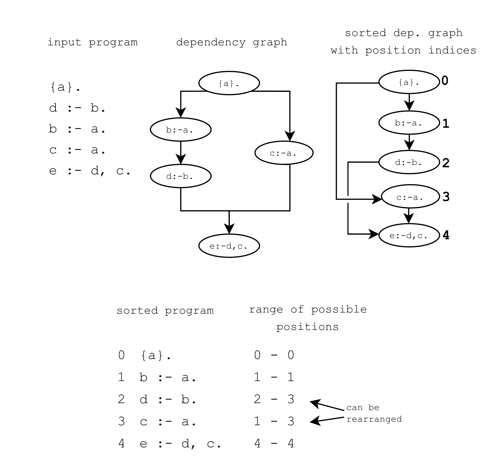
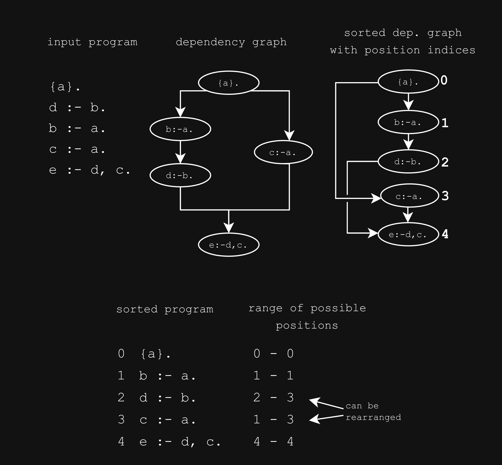

************
How it Works
************

Architecture
============

viASP is built on a server and client architecture. When using the ``viasp`` CLI, the processes are combined, so that only the clingo calls and the client is visible to the user.

The server is a Flask backend, which uses Clingo, SQLAlchemy with SQLite, NetworkX for graph operations, and waitress for serving the app. A log file ``viasp.log`` is always created in the current working directory.

The client is a React frontend served by Dash. Recoil is used for state management, styled-components for styling.

viASP Graph generation
=======================

The viASP server generates the graph based on  

1. The input program
2. The marked stable models

After receiving these inputs, the ``show`` command has to be called to initiate graph generation.

The generation of the viASP graph can be broken down into two steps:

1. sorting the input program, then
2. associate the marked models' symbols with the rules they are derived by.

Sorting the program
-------------------

The viASP server sorts the input program, which is received through the API calls ``load_program_file`` or ``load_program_string``.
They reach the ``/control/add_call`` endpoint that stores the programs in the server's database.

If the program is split into multiple files (e.g., encoding and instance files), they can be loaded separately, as long as they are loaded during the same session.

Once the ``show`` command is called, all program strings are retrieved from the database. The ``ProgramAnalyzer`` Transformer class sorts the rules in the program by building and sorting a dependency graph.

Each rule in the program turns into a node of the dependency graph.
To represent dependencies between rules, edges are added to the graph.
A rule depends on another rule, if the body of the first rule contains a symbol that is in the head of the second rule.
Thus, edges point from rules with symbol signatures in the head to rules with the signature in the body.

Some processing on the graph removes loops and cycles, and collects integrity constraints into a single node. The rules in the loops or cycles are combined and marked to become a recursive component in the final graph.

Because some rules are combined into a collection of rules at this step, the nodes are referred to as components from here on (the code may still refer to them under their old terminology as transformation).

The ``ProgramAnalyzer`` then uses a custom sorting algorithm, that is a variation of Kahn's algorithm for topological sorting. It repeatedly removes nodes with no incoming edges from the graph and adds them to the sorted program. The process is repeated until all nodes are removed from the graph. If there are multiple nodes with no incoming edges, the algorithm chooses the node with the earliest occurrence in the input program. This ensures that the order of the components in the input program is preserved as much as possible.

Since viASP allows the user to rearrange components, each component is assigned a range of possible positions at which they generate a different valid sort. The range is defined by the sorted positions of the adjacent nodes in the dependency graph. Rearranging a component to an index within that range yields a so-called “adjacent sort”. The possible adjacent sort positions are stored in the ``adjacent_sort_indices`` attribute of the component.

The sorted program may be queried from the server using the ``/graph/sorted_program`` endpoint. The list of components is returned in the order they appear in the sorted program.

   The generation and sorting of a dependency graph based on the input program ``{a}. d :- b. b :- a. c :- a. e :- d, c.``. The graph is sorted to ``{a}. b :- a. d :- b. c :- a. e :- d, c.``. The range of possible positions for each component is based on the index of predecessor and successor components in the sorted program. The components containing ``d :- b.`` and ``c :- a.`` can be rearranged in the range ``2-3`` and ``1-3``, respectively.

   The generation and sorting of a dependency graph based on the input program ``{a}. d :- b. b :- a. c :- a. e :- d, c.``. The graph is sorted to ``{a}. b :- a. d :- b. c :- a. e :- d, c.``. The range of possible positions for each component is based on the index of predecessor and successor components in the sorted program. The components containing ``d :- b.`` and ``c :- a.`` can be rearranged in the range ``2-3`` and ``1-3``, respectively.

Associate Symbols with their Rules and Reasons
----------------------------------------------

Justifier Program
^^^^^^^^^^^^^^^^^

A justifier program is generated from the sorted program by the ``ProgramReifier`` Transformer class in order to detect which rules are responsible for the symbols in the stable model.
It also generates the reasons, a set of symbols responsible for its derivation, which is highlighted in the viASP graph when the symbol is clicked.

Every rule in the sorted program is used to generate a justification rule.

A normal input rule:

.. code-block::

    d1 :- r1, ..., rl.

is transformed into the justifier rule

.. code-block::

    h(I, J, d1, (r1, ..., rl)) :- d1, r1, ..., rl.

This connects the symbol ``d1`` in the head of an input rule with the reasons ``r1, ..., rl``, the index ``I`` of the component in the sorted program, and the hash ``J`` identifying the rule.

.. admonition:: Example

    For example, the rule

    .. code-block:: 

        reached(V) :- reached(U), hc(U,V).

    is transformed into

    .. code-block:: 

        h(1, "0", reached(V), (reached(U), hc(U,V))) :- reached(V), reached(U), hc(U,V).

.. A more complete discussion of the justifier program, including all ASP constructs and edge cases, is given in a different place.

Marked Models and Justification
^^^^^^^^^^^^^^^^^^^^^^^^^^^^^^^

Stable models are marked through the API calls ``mark_from_clingo_model``, ``mark_from_string``, or ``mark_from_file``.
They are not yet propagated to the server, so that they can be unmarked again e.g., when a more optimal model is found.
Once the ``show`` command is called, they are sent to the server where they reach the ``/control/models`` endpoint.

The stable model represented as facts and the justifier program are loaded in a clingo Control instance.
Grounding yields the ``h`` symbolic symbols, which can be queried from the Control object. This process is repeated for every stable model to build the separate branches.

Command Line Tool
=================

The ``viasp`` command line tool is a wrapper around the viASP server and client.

When the ``viasp`` command is called, a python script, located in ``viasp/backend/src/viasp/__main__.py``, uses the viASP python API (:ref:`API Documentation`) to start a visualization.

First, the ``clingo`` command is called with the input program to get stable models and solver statistics in the shape of clingo's JSON output.
In case a clingo JSON output was provided as input to viASP, the script simply analyzes the input to get stable models and statistics.
Clingo's JSON is used as a basis for the command line output, which mocks the default clingo output.

The script then starts the viASP server, sends the stable models and the input program to the server, and initiates the server's graph generation.
If provided, the script also sends the clingraph encoding to the server.

Lastly, the script starts the Dash server, which serves the viASP client. The client is opened in the default browser.

In the case of an unsatisfiable input program, the script suggests using the relaxation mode through the ``--print-relax`` or ``--relax`` options. With these flags, the script either prints the relaxed program retrieved by calling the server's relaxation endpoint, or uses this program to generate a new viASP graph.

A second command is available to start only the viASP server without the client. This may be useful to interact with the server through the API. The command is ``viasp_server``.

React Frontend
==============

The viASP client is a React frontend served by Dash. The client is located in the ``viasp/frontend`` directory.

To support multiple simultaneous sessions running on the same server, the client uses a token to identify the session. It is appended to the URL as a query parameter (e.g., ``http://localhost:8050/?token=0``) and after the initial load, it is stored in the session storage.

The client uses Recoil for state management. Several recoil selectors query the server API to get separate parts of data needed for the visualization. This modular approach allows greater flexibility and faster loading times.

Upon loading the client, the identifier of the current sort order is retrieved from the server (``/graph/current``). The identifier is used on subsequent requests to the server to identify the current sort order. Additionally, the client retrieves the number of components in the sorted program (``/transformations/current``), so that it can initialize the correct number of rows in the graph.

A POST request is sent to the ``/graph/transformations`` endpoint with the current sort hash and the transformation ID in the request. This request retrieves the data for the specified transformation, including the transformation hash, the rules in the component, the adjacent sort indices, and whether it contains only integrity constraints.

Each component that does not contain only integrity constraints, a POST request is sent to ``/graph/children`` with the current sort hash and the component's transformation hash. This request retrieves the nodes of the row.

Lastly, the edges are retrieved by sending a POST request to the ``/graph/edges`` endpoint with the current sort hash, information about currently expanded recursive nodes, and a flag if clingraph is included. This request retrieves the edges between the nodes.

Thus, to build the basic viASP graph, the client queries the current sort hash, the number of components, the components, the nodes, and the edges. The full viASP in shape of NetworkX's node-link data format can also be queried from ``/graph``.

Besides these requests, the client also sends requests to get the clingraph visualizations if included.

When a symbol is clicked in the graph, a POST request is sent to the ``/graph/reason`` endpoint with the current sort hash, the symbol UUID, and the node UUID. This request retrieves the justifications in form of the hash of the rule that derives the symbol and the arrows that connect the symbol to its reason symbols.

When the user rearranges the sort, a POST request is sent to the ``/graph/sorts`` endpoint with the current sort hash and the old and new positions of the component. This request returns the hash of the new sort order. The new sort order is then used to query the new components, nodes, and edges.
